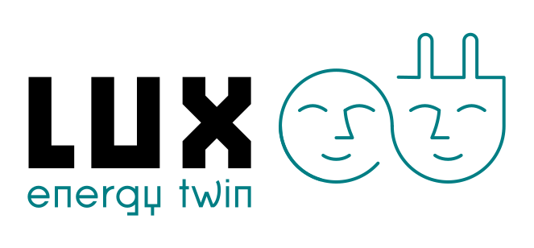

 

&nbsp;&nbsp;&nbsp;&nbsp;&nbsp;&nbsp;

This is the source code for the websites [lux.energy](https://lux.energy)
and [nieuw.zenmo.com](https://nieuw.zenmo.com)

It is built using [Kobweb](https://github.com/varabyte/kobweb).

A manual for editors is at [wiki.zenmo.com](https://wiki.zenmo.com/books)
